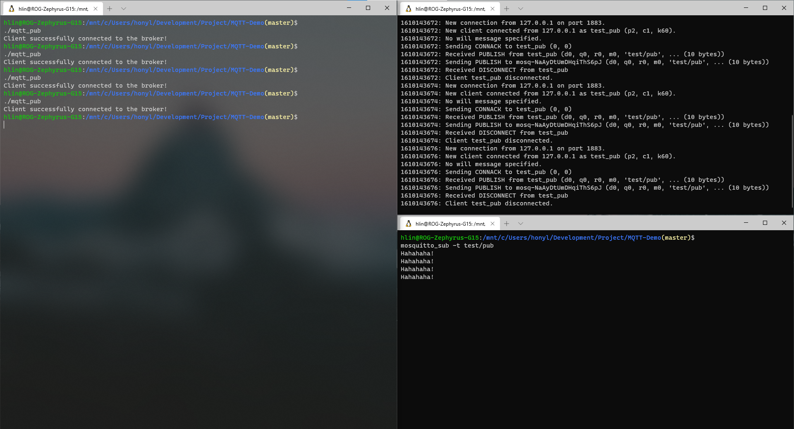
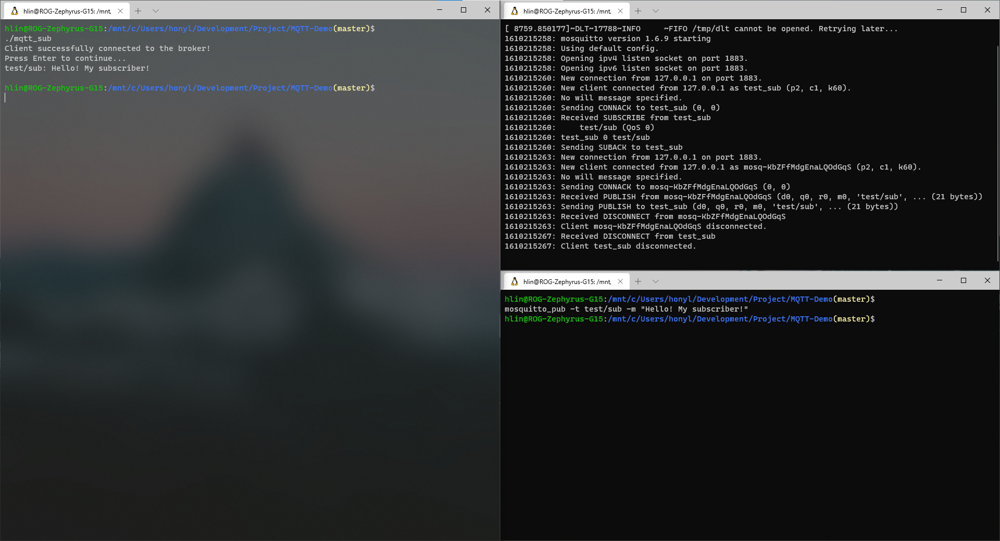

# MQTT-Demo

## Introduction
This is a demo to pratice with MQTT model with mosquitto library. However, mosquitto library is written in C, so it is implemented in a procedural way. In this demo, I will try to wrap the functionality in mosquitto library with class in C++.

## Environment and Dependencies
Environment: Ubuntu 20.04
```bash
sudo apt-get install gcc g++ mosquitto mosquitto-clients libmosquitto-dev
```

## Build
```bash
make all
```

## Results



## Reference
[Write a MQTT Publisher Client in C with the Mosquitto library](https://www.youtube.com/watch?v=ERPhUsmbhMo&t=45s) </br>
[Write a MQTT Subscriber in C with mosquitto lib](https://www.youtube.com/watch?v=K6Q1Sd9edCw&t=497s)